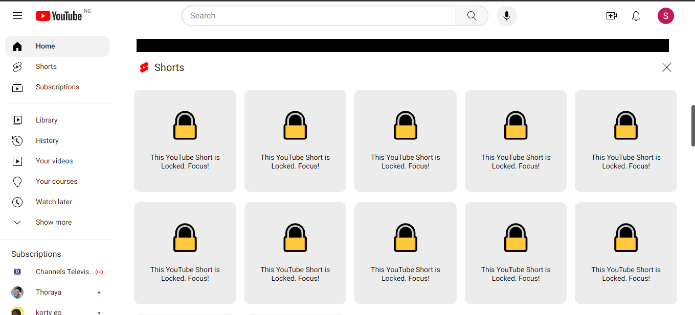

A simple and light-weight Chrome extension for hiding YouTube shorts to regain your productivity.

# Uses

- Parcel bundler
- HTML
- JavaScript

# Usage

This is a Chrome extension designed for development and testing purposes. You can easily load and use it in developer mode. To get started, follow these steps below:

1. **Clone the Repository**:

```bash
git clone https://github.com/rexsimiloluwah/hide-youtube-shorts.git
```

2. **Open Chrome Extensions**

   - Open Google Chrome
   - Go to `chrome://extensions/` in your browser

3. **Enable Developer Mode**:

   - In the top-right corner of the `chrome://extensions/` page, toggle the "Developer Mode" switch to the on position.

4. **Load the Extension**

   - Click on the "Load Unpacked" button
   - Select the `dist` folder from the cloned extension repository

5. **Confirm Installation**:

   - The extension should now be visible in the list of installed extensions.
   - Ensure it is enabled by checking the "Enabled" box.

6. **Test the Extension**:

   - Navigate to `https://youtube.com`
   - The YouTube shorts should be hidden as shown in the screenshot below


